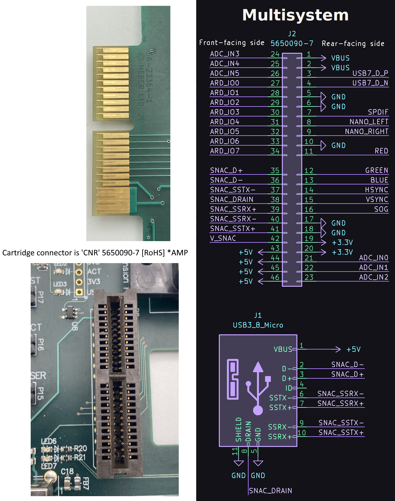
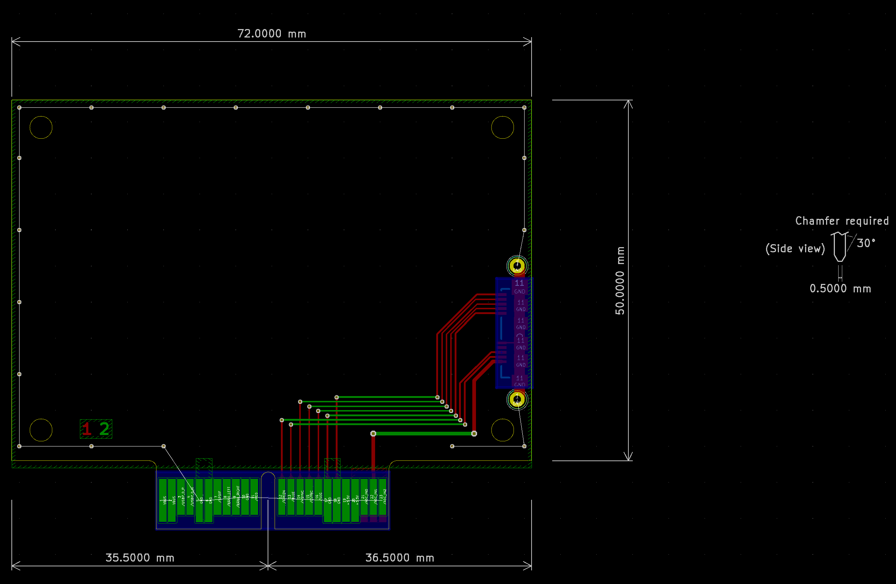
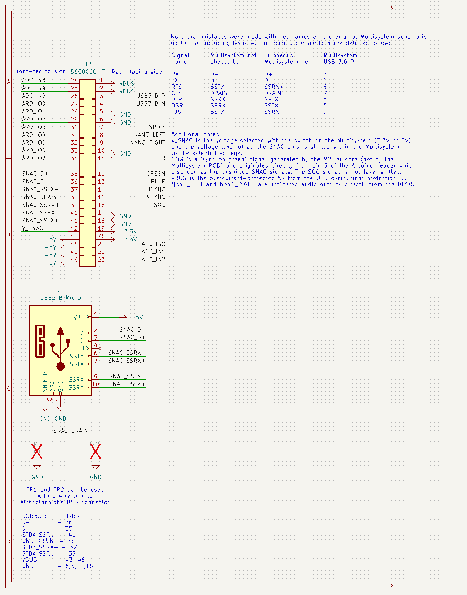

# Heber Expansion Cartridge templates

KiCad templates for cartridges for the Multisystem and Multisystem2 / Future Multisystems.

Schematic includes the edge connector with appropriately labelled nets.

PCB includes the edge connector and a board outline.

The Multisystem cartridge also includes a micro USB 3.0 connector, which enables SNAC cartridges to be connected to other MiSTer FPGA systems. On the Multisystem, the V_SNAC signal from the edge connector and power from the USB connector will be at 5V or 3.3V depending on the voltage setting on the Multisystem, but on other MiSTer systems, the voltage from the USB connector is always 5V even when a level shifter is used. VBUS on the edge connector is current-limited 5V from the USB current limiting IC whereas 5V on the edge connector is from the main power input protected only by the main polyfuse. Also note that the SSRX and SSTX pairs are swapped in the micro USB connector; this is because the SSRX pins at the USB end connect to SSTX at the micro USB end of the cable and vice versa.

On Multisystem 2, V_SNAC is fixed at 3.3V and the level of the signals from the system are 3.3V. We recommend designing any SNAC cartridge for 5V devices with on-board level shifters so that they will be compatible with Multisystem and Multisystem 2. The common BSS138 level shifting circuit is sufficient and the pull-ups on the system side should be connected to V_SNAC for correct signal levels on the system side regardless of the position of the 5V/3.3V switch on Multisystem.

If you wish to make your own Cartridges for the Multisystem/Multisystem2, please use this template so they will be compatible.

## Board finish
Never use HASL. Use ENIG.

All official Heber cartridges feature hard gold plating on the edge contacts to improve the long term reliability of the contacts. This is an extra cost option available from most PCB manufacturers and is quite expensive to add if you are ordering prototypes; the boards will of course work without hard gold plating, but standard gold plating will wear off the pads quickly and reduce the reliability over the long term.

## Signals 
 - USB 2.0
 - GPIO Pins (3.3v)
 - Analogue input signals
 - +5V (2A max)
 - +3.3v (1A max)
 - GND
 - VBUS (Selectable voltage on the Multisystem board 3.3v or 5v)
 - Full SNAC/USER PORT
 - Digital Audio output
 - Analogue Audio output
 - RGBHV Analogue video output - various display modes & Standards.
 - Sync On Green signal

